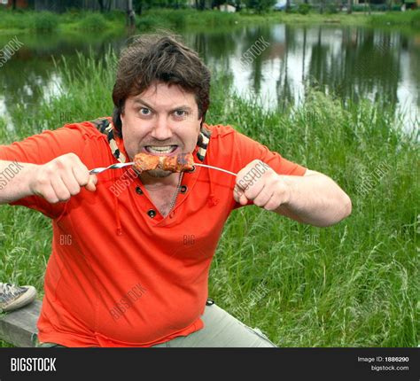

<html>
    <head>
        <title>My First Project</title>
        <meta charset="UTF-8">
        <link rel="stylesheet" href="assets/css/style.css"/>
    </head>
    <body>
        <h1 class="title">Odin Recipes</h1>
        
        <ol class="recipe-list">
            <li><a href="recipes/chili.html">Chili</a></li>
            <li><a href="recipes/chicken.html">Chicken Piccata</a></li>
            <li><a href="recipes/waffles.html"><strong>Waffles!</strong></a></li>
        
        
        
        </ol>
        
        
        <h5 class="message">Chicken, Chili, and Waffles are the only three recipes that a true man should ever need.</h5>
        
    </body>
</html>